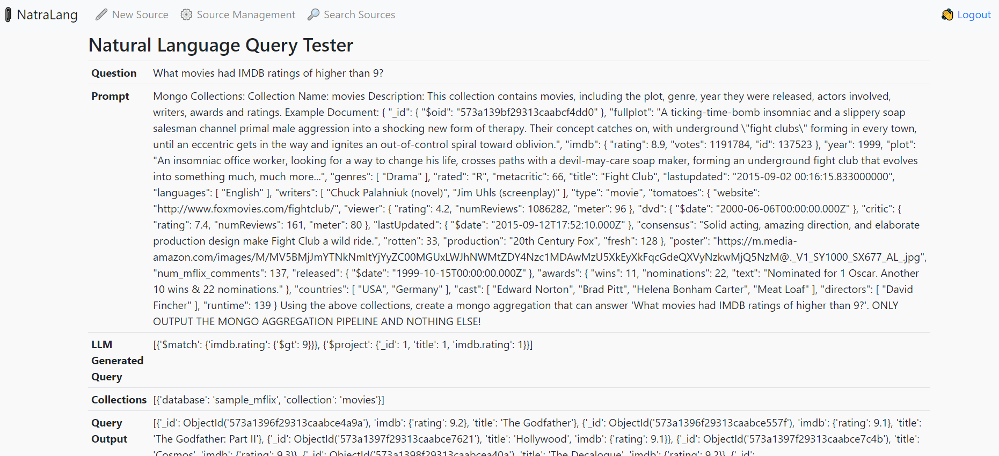
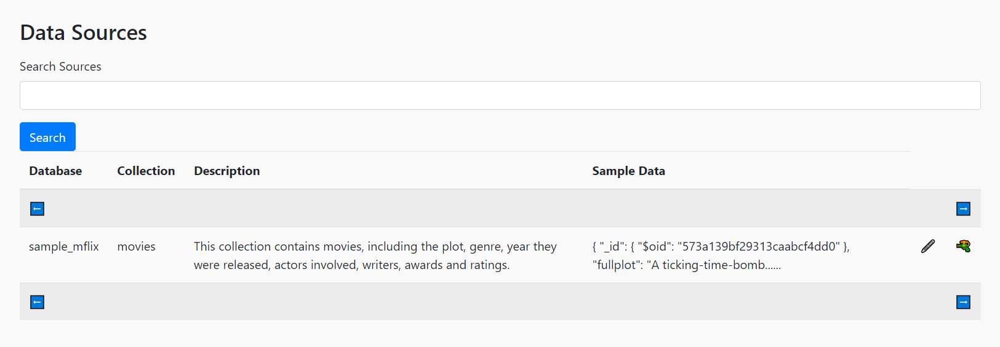
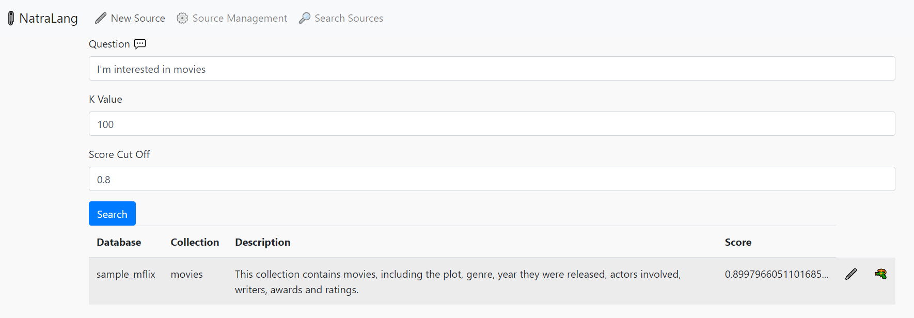

# NatraLang

Natural language query for MongoDB.  Why write queries when the LLM can write them for you?

* Supports Mistral.ai, OpenAI and Azure OpenAI
* Requires Atlas (https://www.mongodb.com/products/platform/atlas-database)
* Uses Vector Search to find your data sources -- context window will just have relevant collections for LLM to reason about





## Installation

Create a dedicated cluster on MongDB Atlas (7.x or higher), Under Database Access add a database user in Password mode, with the built in role of "read/write any database".  Click on Network Access and add your personal IP or 0.0.0.0 if you're comfortable with any IP connecting to this cluster.

Sign up with Mistral.ai or OpenAI and get an API key.

```
pip install -r requirements.txt
```

## Docker Installation

```
git pull https://github.com/patw/Natralang.git
cd Natralang
```

* Follow the instructions below on configuring the .env, model and embedder configs

```
docker build -t natralang .
docker run -d -p 7861:5000 natralang
```

## Running 

After the application has been configured (.env is correct), you can start it with the script files and load the UI by going to:

http://localhost:7861

### Linux / MacOS 

```
./nl.sh
```

### Windows 

```
nl.bat
```

## Configuration

Copy the sample.env file to .env and edit this file.  This contains all the important configuration variables for the application to run.

* MONGO_CON - This will be your srv style connection into Atlas Mongo, you can get this from the Atlas UI by selecting Connection and using python for the language
* MONGO_DB - The database you want to connect to.  "natralang" is default.
* SECRET_KEY - This is the session key for Flask, it can be anything you want
* USERS - This is a json doc of user/password keys, set this to something you remember so you can log into system
* SERVICE - "mistral" for Mistral.ai, "azure" for azure openai or "openai" for OpenAI
* MODEL_NAME - This is the model name to use with each service.  See file for examples
* OPENAI_API_KEY - This is your OpenAI Key. You only need this configured if you are using OpenAI. 
* MISTRAL_API_KEY - This is your Mistral.ai Key. You only need this configured if you are using Mistral.ai.